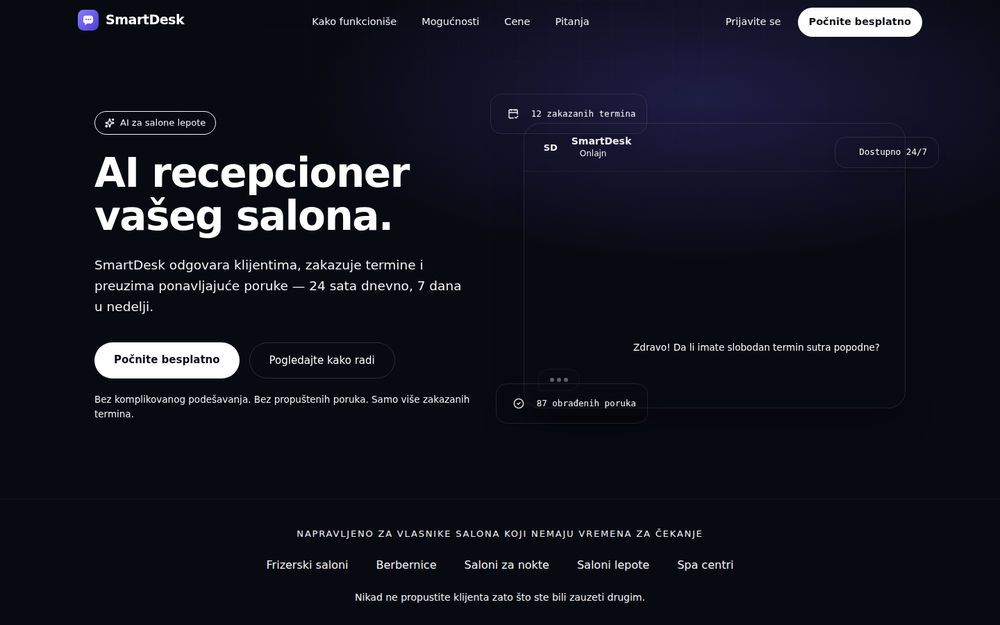
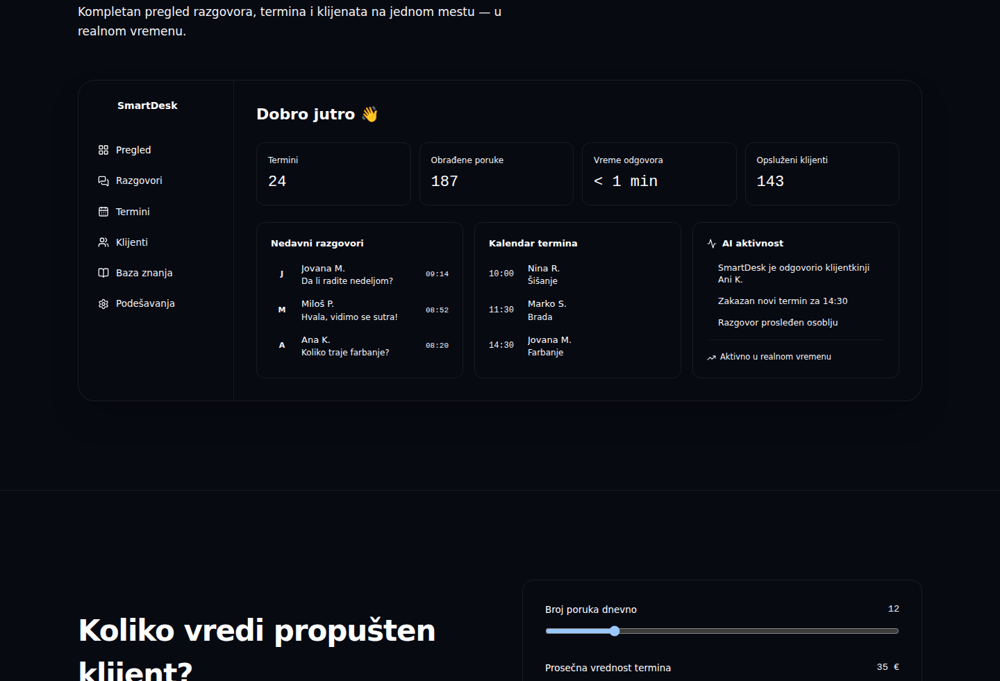

# SmartDesk

**AI recepcioner vašeg salona.**

SmartDesk odgovara klijentima, zakazuje termine i preuzima ponavljajuće poruke — 24 sata dnevno, 7 dana u nedelji. Ovaj repozitorijum sadrži landing stranicu proizvoda, izgrađenu kao production-ready temelj spreman za povezivanje sa pravim backendom.



---

## Šta je SmartDesk?

SmartDesk je AI recepcioner namenjen salonima lepote, frizerskim salonima, berbernicama, salonima za nokte i spa centrima. Umesto da vlasnik ili osoblje salona ručno odgovaraju na svaku poruku klijenta, SmartDesk preuzima taj razgovor: razume pitanje, odgovara prirodnim jezikom koristeći informacije o salonu i pomaže klijentu da zakaže termin — bez čekanja i bez prekidanja rada sa klijentom koji je fizički u salonu.

Ovaj repozitorijum je **marketinška/landing stranica proizvoda** (React aplikacija), a ne sam AI sistem — napravljena je da ozbiljno predstavi proizvod, objasni kako funkcioniše i pretvori posetioce u korisnike, dok je struktura koda pripremljena za kasnije povezivanje sa pravim backendom i AI mehanizmom.

## Koji problem rešava

Vlasnici salona svakodnevno gube vreme i klijente zbog:

- **Propuštenih poruka** — klijenti pišu dok je osoblje zauzeto drugim klijentom.
- **Ponavljajućih pitanja** — ista pitanja o ceni, radnom vremenu i uslugama ponavljaju se iz dana u dan.
- **Izgubljenih termina** — spor odgovor često znači da klijent rezerviše kod konkurencije.
- **Poruka van radnog vremena** — najveći deo poruka stiže baš kada je salon zatvoren.

SmartDesk sve ovo automatizuje, tako da salon ne propusti nijedan potencijalni termin, a osoblje se fokusira na klijente koji su već u salonu.

## Glavne funkcionalnosti

- **AI razgovori** — prirodna komunikacija sa klijentima kroz chat.
- **Zakazivanje termina** — pomaže klijentima da pronađu i rezervišu slobodan termin.
- **Dostupnost 24/7** — odgovara i kada je salon zatvoren.
- **Automatski odgovori na česta pitanja** — cene, usluge, lokacija, radno vreme i drugo.
- **Informacije o klijentima** — organizovan pregled razgovora i istorije.
- **Pametna obaveštenja** — salon se obaveštava kada je potrebna ljudska intervencija.
- **Predaja razgovora osoblju (human handoff)** — kompleksni upiti se prosleđuju timu.
- **Više kanala komunikacije** — arhitektura pripremljena za Instagram, WhatsApp, Facebook Messenger i sajt chat (nisu još implementirani).
- **Dashboard pregled** — pregled termina, razgovora, klijenata i AI aktivnosti na jednom mestu.
- **ROI kalkulator** — interaktivna procena koliko vredi propušten klijent.

## Tehnologije

- **React 19** + **TypeScript**
- **Tailwind CSS v4** (`@tailwindcss/vite`)
- **React Router** — rutiranje između landing stranice i pomoćnih stranica
- **Framer Motion** — animacije pri skrolovanju
- **Lucide React** — ikonice
- **Vite** — build alat i dev server

Struktura projekta:

```
src/
  components/   # Navbar, Hero, ChatDemo, Problem, HowItWorks, Features,
                # DashboardPreview, ROICalculator, Pricing, Testimonials,
                # Security, FAQ, FinalCTA, Footer, Logo, SocialIcons
  data/         # content.ts — sav tekstualni sadržaj, cene, FAQ, itd.
  pages/        # Landing, Signup, Login, Contact (placeholder stranice)
```

## Screenshot aplikacije

| Hero sekcija | Dashboard pregled |
|---|---|
|  |  |

## Kako se pokreće lokalno

Potreban je Node.js (v18 ili noviji).

```bash
# 1. Instaliraj zavisnosti
npm install

# 2. Pokreni razvojni server
npm run dev
```

Aplikacija će biti dostupna na `http://localhost:5173`.

Ostale komande:

```bash
npm run build     # produkcioni build (izlaz u dist/)
npm run preview   # lokalni pregled produkcionog build-a
npm run lint      # provera koda
```

## Buduće funkcionalnosti

Sledeće funkcionalnosti su najavljene na landing stranici, ali još nisu implementirane u proizvodu i planirane su za naredne faze razvoja:

- Prava integracija AI modela za razumevanje i generisanje odgovora
- Povezivanje kanala: Instagram, WhatsApp, Facebook Messenger, sajt chat widget
- Pravi backend za zakazivanje termina i sinhronizaciju kalendara
- Autentifikacija i onboarding tok (trenutno `/registracija` i `/prijava` su placeholder forme)
- Napredna analitika i izveštaji po lokaciji
- Podrška za više lokacija istog salona (Business plan)
- Prilagodljiva baza znanja salona (cene, usluge, radno vreme) kroz dashboard
- Sistem uloga i dozvola za osoblje (role-based access)
- Besplatni probni period sa punom konfiguracijom

## Live Demo

🔗 **[https://filipfilipovic-cell.github.io/SmartDesk-/](https://filipfilipovic-cell.github.io/SmartDesk-/)**

---

© 2026 SmartDesk. Sva prava zadržana.
